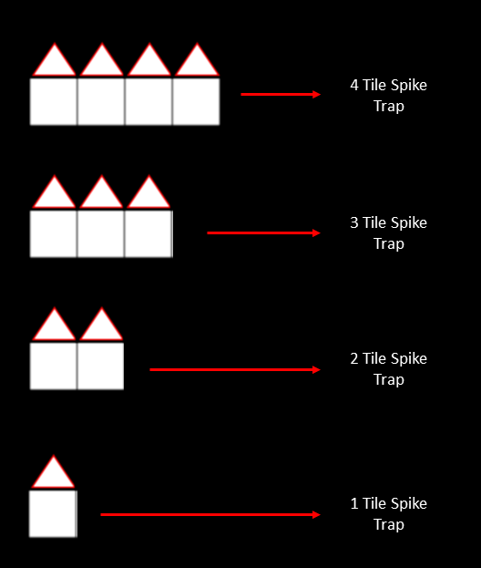

# Projeto de Recurso de Fundamentos de Programação 2022/2023

**LER COM ATENÇÃO O ENUNCIADO ANTES DE IMPLEMENTAR!**

## Introdução 
Todos os grupos devem implementar em Python um jogo chamado *Don't Look Down*. Este jogo necessita **obrigatóriamente** interface gráfica em PyGame.

## Contexto do Jogo

*Don't look down* é um *roguelike* inspirado no jogo [Downwell](https://store.steampowered.com/app/360740/Downwell/), onde o objetivo é obter a maior pontuação possível. O jogador controla um boneco chamado *fallguy* que está em queda livre, onde o objetivo é evitar inimigos e armadilhas que aparecem pelo caminho, e *aguentar* o mais tempo possível. 

### Objectivo do Jogo

O objectivo deste jogo é simplesmente sobreviver o maior tempo possível, evitando os obstaculos que vão aparecendo pelo caminho do jogador. 

### Descrição Técnica

Esta secção descreve as funcionalidades **core** do jogo. O jogo joga-se com uma resolução de 900x600 (900px de altura e 600px de largura). 

#### Gameplay

O jogo joga-se com o teclado usando as setas (exclusivamente esquerda e direita). É importante realçar que **o jogador está constantemente em queda livre**, com a excepção de plataformas sem armadilha.

##### Death

Se o jogador cair em cima ou tocar numa armadilha, o jogador *morre* perdendo uma vida. Quando o numero total de vidas chegar a 0 o jogo deve mostrar o ecrã de *Game Over*. Após cerca de 2 segundos, o ecrã passa a mostrar o *Leaderboard* (ver abaixo), caso o jogador tiver pontuação suficiente permite inserir as suas siglas. Após de cerca de 2 segundos no ecrã do *Leaderboard* o jogo volta para o *Start* (ver abaixo). 

O jogador começa com 3 vidas.

##### Point Scoring

Os pontos do jogo estão interligados diretamente ao tempo de jogo total. A cada segundo de jogo é adicionado 1 ponto ao score total do jogador. 

#### O Nivel 

O nivel está configurado para alojar *tiles* de 50x50px, onde cabe 12 e 18 tiles em largura e altura, respectivamente.

A area de jogo consiste nos 10 tiles mais à esquerda, enquanto as ultimos 2 tiles estão reservados para o UI do jogo. Na área de jogo a coluna mais à esquerda e a coluna mais à direita estão reservadas para os muros (area onde o jogador não pode passar através, nem destruir). Estes muros define o limite da area de jogo.

A configuração do nivel fica ao critério de cada aluno, no entanto é obrigatório incluir no minimo 25 instancias do tipo *traps* (ver abaixo). Todos os tiles podem ser arranjadas de qualquer forma no nível, no entanto é necessário **garantir que todas estejam alinhadas com os tiles das paredes**.

Cada obstaculo consiste numa sequencia de tiles modificadas com um risco direto para o jogador. Para o jogo básico basta implementar o *Spiked Trap*, enquanto o *Hedgehog Trap* consiste em pontuação extra para o aluno (ver pontuação extra).

##### Spiked Traps

O *Spike Trap* é uma armadilha estática, que consiste num conjunto de tiles com triangulos:

Se o jogador cair em cima de uma destas armadilhas este perde immediatamente uma vida fazendo *reset* ao jogo, ou no caso das vidas ficarem a 0 mostra o ecrã de *Game Over*. 

**Nota**: Cabe ao aluno de configurar o seu nível de forma a que o jogo seja minimamente possível para o jogador considerando os parâmetros da queda livre e do movimento. Ou seja, tentem não criar sequências extremamente dificeis ou impossíveis. 

#### Interface

O User Interface deverá apresentar o numero de vidas do jogador (3 no total), o total de pontos acumulado e o número de balas corrente. 

##### Start Screen

Ao iniciar o jogo, é necessário apresentar um "Start Screen" com três opções: *Start*, *Leaderboard* e *Quit*. 

**Start** inícia o jogo seguindo o processo definido acima. 

**Leaderboard** mostra o os 10 jogadores com melhor pontuação durante 2 a 3 segundos, após retorna ao *Start*.

**Quit** termina o processo do jogo.  

##### Game Over

O ecrã de Game Over consiste apenas num ecrã com as palavras Game Over em letras grandes, durante um total de tempo de 2 a 3 segundos.

##### Leaderboard

O leaderboard deve guardar as iniciais e score dos 10 melhores jogadores até à data. O jogo deve pedir as iniciais do jogador caso o score obtido no final for maior do que ultimo valor presente no leaderboard. Este ecrã é mostrado em duas instâncias, se for selecionado pelo jogador no *Start Screen* ou depois do ecrã de *Game Over*. Para ambas as instancias o ecrã deve ser mostrado até o utilizador carregar no enter ou durante um total de 3 a 5 segundos.

O leaderboard deverá ser permanente (mesmo quando se desliga o jogo), e para isso é necessário escrever para um ficheiro os valores destes. Para tal é necessario usar funções de read e write para um ficheiro de texto que irá ser guardado na pasta local do jogo. Funções uteis para ver:

- [Read File](https://www.w3schools.com/python/python_file_open.asp)
- [Write File](https://www.w3schools.com/python/python_file_write.asp)

## Objetivos e Critério de Avaliação

Este projeto tem os seguintes objetivos:

-   **O1** - Programa deve funcionar como especificado. Atenção aos detalhes, pois é fácil desviarem-se das especificações caso não **leiam o enunciado com atenção**.
-   **O2** - Projeto e código bem organizados, nomeadamente:
    -   Código devidamente comentado e indentado.
    -   Inexistência de código "morto", que não faz nada, como por exemplo variáveis, propriedades ou métodos nunca usados.
    -   Projeto compila e executa sem erros e/ou _warnings_.
-   **O3** - Projeto adequadamente documentado com *comentários* descrevendo a funcionalidade de várias secções do código.
-   **O4** - Repositório Git deve refletir boa utilização do mesmo, nomeadamente:
    -   Devem existir _commits_ de todos os elementos do grupo, _commits_ esses com mensagens que sigam as melhores práticas para o efeito (como indicado [aqui](https://chris.beams.io/posts/git-commit/), [aqui](https://gist.github.com/robertpainsi/b632364184e70900af4ab688decf6f53), [aqui](https://github.com/erlang/otp/wiki/writing-good-commit-messages) e [aqui](https://stackoverflow.com/questions/2290016/git-commit-messages-50-72-formatting)).
    -   Ficheiros binários não necessários, não devem estar no repositório. Ou seja, devem ser ignorados ao nível do ficheiro `.gitignore`.
-   **O5** - Relatório em formato [Markdown](https://guides.github.com/features/mastering-markdown/) (ficheiro `README.md`), organizado da seguinte forma:
    -   Título do projeto.
    -   Autoria:
        -   Nome dos autores (primeiro e último) e respetivos números de aluno.
        -   Informação de quem fez o quê no projeto. Esta informação é **obrigatória** e deve refletir os _commits_ feitos no Git.
        -   Indicação do repositório Git utilizado. Esta indicação é opcional, pois podem preferir manter o repositório privado após a entrega.
    -   Arquitetura da solução:
        -   Descrição da solução, com breve explicação de como o código foi organizado, bem como dos algoritmos não triviais que tenham sido implementados.
    -   Referências, incluindo trocas de ideias com colegas, código aberto reutilizado (e.g., do StackOverflow) e bibliotecas de terceiros utilizadas. Devem ser o mais detalhados possível.
    -   **Nota:** o relatório deve ser simples e breve, com informação mínima e suficiente para que seja possível ter uma boa ideia do que foi feito. Atenção aos erros ortográficos e à correta formatação [Markdown](https://guides.github.com/features/mastering-markdown/), pois ambos serão tidos em conta na nota final.

O projeto tem um peso de 12 valores na nota final da disciplina e será avaliado de forma qualitativa. Isto significa que todos os objetivos têm de ser parcialmente ou totalmente cumpridos. A cada objetivo, O1 a O5, será atribuída uma nota entre 0 e 1. A nota do projeto será dada pela seguinte fórmula:

_N = 12 x O1 x O2 x O3 x O4 x O5_

Isto significa que se os alunos ignorarem completamente um dos objetivos, não tenham feito nada no projeto ou não comparecerem na discussão, a nota final será zero.

### Notas Relativo a Época de Recurso/Especial

A avaliação para época de recurso/especial consiste em ambas numa avaliação prática e teórica (através de teste). **Para garantir passagem para a componente teórica, e passagem à disciplina, o aluno terá que necessáriamente ter uma nota mínima de 9.5 no projeto.**

### Requisito Mínimo do Projeto

Tudo descrito no enunciado são as funcionalidades minimas para este projeto (com a excepção do que está definido como pontuação extra), e isto inclui:

- Interface de Jogo
- Sistema de Menus
- Um nível completo (cerca de ~60 segundos de jogo).
- Gameplay - Queda Livre
- Gameplay - Spiked Traps
- Gameplay - Vidas
- Leaderboards Persistentes

### Pontuação Extra

**Importante**: Façam o minimo requerido primeiro antes de tentarem fazer mais funcionalidades!

#### Bullets (Pontução Extra)

O jogador tem acesso a um total de 3 *bullets* que permite "destruir" *tiles* e *traps* (ver abaixo) ajudando o jogador a passar através destas sem dano. O bullet também permite reduzir a velocidade de queda do jogador permitindo fazer manobras mais precisas se necessario.

Para usar bullets o jogador usa o *spacebar* (tecla espaço), no qual dispara uma esfera diretamente abaixo do *fallguy* a uma velocidade elevada comparativamente ao do jogador. O projetil segue uma linha recta de cima para baixo do local onde foi disparado. Se a esfera collidir com uma armadilha este é distruida por completo, deixando o jogador atravesá-la. Ao disparar o bullet o jogador irá diminui immediatamente a velocidade de queda durante um intervalo especificado pelo aluno. 

O jogador tem um total de 3 balas, cada bala tem um tempo de regeneração (definido pelo aluno). Se não houver balas, o jogador não pode disparar. 

#### **Hedgehog Trap* (Pontuação Extra)

O **Hedgehog Trap** consiste numa armadilha dinâmica onde um pequeno ouriço vai-se movendo a uma velocidade constante da esquerda e para a direita, obrigando o jogador a não ficar demasiado tempo em cima de uma plataforma.

#### Nivel Procedural (Pontuação Extra)

Criar um nivel infinito em que os tiles são alocados de uma forma dinâmica. Neste caso é importante considerar que o aluno tem que garantir que o que é gerado pelo algoritmo é possível, e que não cria cenários impossíveis. 

##### Garantia de Possibilidade

Para garantir que o jogo é sempre possível é necessario limitar o algoritmo de colacação de tiles. Uma forma simples de garantir possibilidade é nunca deixar o algoritmo encher uma linha com mais de 6 tiles (ou seja deixar sempre um *gap* para o jogador passar). 

É também necessario limitar a colocação de tiles a nivel de altura para dar tempo ao jogador reagir às mudanças do cenário, no entanto esta configuração irá depender totalmente na implementação de cada aluno, já que irá depender na rapidez da queda livre e da translação definida. Por isso façam o playtest!

## Entrega
O projeto deve ser entregue pelo aluno via Moodle até às **23:59** do dia **3 de Fevereiro 2023**. O aluno deve submeter um ficheiro `zip` com a solução completa, nomeadamente:

-   Pasta escondida `.git` com o repositório Git local do projeto.
-   Pasta do projeto, contendo os ficheiros todos deste.
-   Ficheiro `README.md` contendo o relatório do projeto em formato [Markdown](https://guides.github.com/features/mastering-markdown/).
-   Ficheiro de imagem contendo o Fluxograma. Este ficheiro deve ser incluído no repositório em modo Git LFS.
-   Outros ficheiros de configuração, como por exemplo `.gitignore` e `.gitattributes`.

**Não serão avaliados projetos sem estes elementos e que não sejam entregues através do Moodle.**

## Honestidade académica
Nesta disciplina, espera-se que cada aluno siga os mais altos padrões de honestidade académica. Isto significa que cada ideia que não seja do aluno deve ser claramente indicada, com devida referência ao respectivo autor. O não cumprimento desta regra constitui plágio.

O plágio inclui a utilização de ideias, código ou conjuntos de soluções de outros alunos ou indivíduos, ou quaisquer outras fontes para além dos textos de apoio à disciplina, sem dar o respectivo crédito a essas fontes. Os alunos são encorajados a discutir os problemas com outros alunos e devem mencionar essa discussão quando submetem os projetos. Essa menção **não** influenciará a nota. Os alunos não deverão, no entanto, copiar códigos, documentação e relatórios de outros alunos, ou dar os seus próprios códigos, documentação e relatórios a outros em qualquer circunstância. De facto, não devem sequer deixar códigos, documentação e relatórios em computadores de uso partilhado, e muito menos usar repositórios Git públicos (embora os mesmos possam ser tornados públicos 12h após a data limite de submissão).

Nesta disciplina, a desonestidade académica é considerada fraude, com todas as consequências legais que daí advêm. Qualquer fraude terá como consequência imediata a anulação dos projetos de todos os alunos envolvidos (incluindo os que possibilitaram a ocorrência). Qualquer suspeita de desonestidade académica será relatada aos órgãos superiores da escola para possível instauração de um processo disciplinar. Este poderá resultar em reprovação à disciplina, reprovação de ano ou mesmo suspensão temporária ou definitiva da ULHT.

_Texto adaptado da disciplina de [Algoritmos e Estruturas de Dados](https://fenix.tecnico.ulisboa.pt/disciplinas/AED-2/2009-2010/2-semestre/honestidade-academica) do [Instituto Superior Técnico](https://tecnico.ulisboa.pt/pt/)_

## Licenças
Este enunciado é disponibilizado através da licença [CC BY-NC-SA 4.0](https://creativecommons.org/licenses/by-nc-sa/4.0/).

## Metadados
-   Autores: [Phil Lopes](https://github.com/worshipcookies) e [Diogo Andrade](https://github.com/DiogoDeAndrade)
-   Curso: [Licenciatura em Videojogos](https://www.ulusofona.pt/licenciatura/videojogos)
-   Instituição: [Universidade Lusófona de Humanidades e Tecnologias](https://www.ulusofona.pt/)
